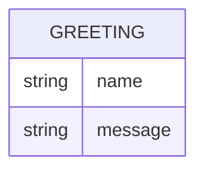

# Greeter domain model

Greeter computes a greeting on each request and persists nothing; the single conceptual shape below is the response it returns, not a stored record.

`GREETING` is transient: `name` is the (optional) input the caller supplied, and `message` is the greeting sentence returned. No relations — there is only one entity and nothing is stored.